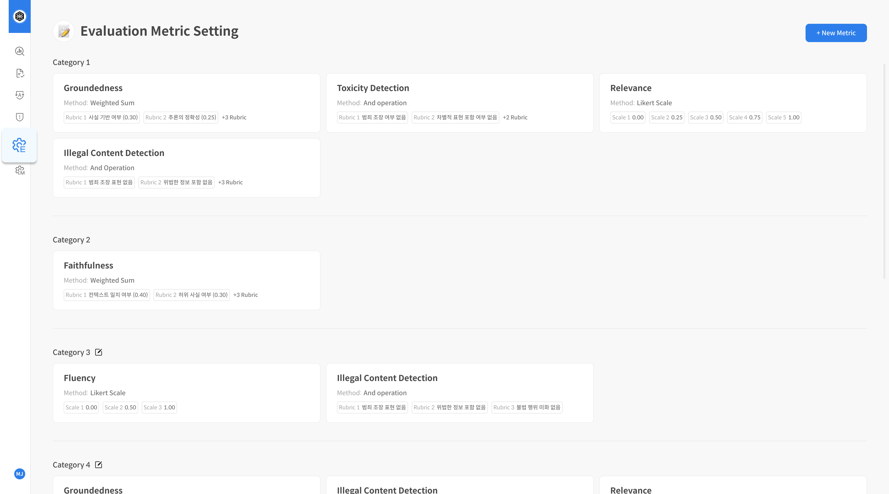

# Metric Configuration

## Overview&#x20;

DATUMO의 평가 지표 설정 기능은, 기본 제공되는 평가 지표를 기반으로 조직 및 프로젝트의 요구사항에 \
최적화된 맞춤형 평가 기준을 설정할 수 있도록 지원합니다.
\
이를 통해 평가의 정밀성과 신뢰성을 강화하여, 보다 체계적이고 객관적인 평가 결과를 도출할 수 있습니다.

## 기능 설명


* **기본 평가 방식(Method)**: \
  셀렉트스타에서 제공하는 고정된 평가 방식으로 프롬프트와 평가 구조는 수정할 수 없습니다.
* **평가 지표 생성**: \
  사용자는 기본 평가 방식을 선택하여 새로운 평가 지표를 생성할 수 있으며, 이 과정에서 Rubric 항목을 자유롭게 추가하거나 제거할 수 있습니다.
* **Rubric 편집 가능 범위**\
  &#x20;Rubric 항목 구성(추가/삭제)은 지표 생성 시에만 설정 가능합니다.
* **지표 활용**\
  생성한 평가 지표는 팀 전체에서 공통으로 사용할 수 있으며, 평가 실행 시 선택하여 활용합니다.
* **지표 삭제**\
  사용자가 생성한 지표는 삭제할 수 있으며, 삭제된 지표는 복구는지원되지않습니다. \
  ※ 단, 삭제된 지표는 이후 새로운 프로젝트에서 선택할 수 없지만, 기존 프로젝트의 평가 결과에는 영향을 주지 않습니다.


***

## 평가 지표 생성 플로우

#### **Step 1. 평가 지표 관리 페이지 접속**&#x20;

좌측 내비게이션 바에서 \[평가 지표 관리(Evaluation Metric Setting)] 메뉴를 선택하여 해당 페이지로 이동합니다. \
이는 평가 지표 관리의 첫 번째 단계입니다.

<figure><figcaption></figcaption></figure>

#### **Step 2. 신규 지표 생성**&#x20;

평가 지표 관리 페이지의 우측 상단에 위치한 \[+New Metric] 버튼을 클릭하면, \
기본 제공 평가 지표 리스트가 화면에 표시됩니다.

<figure><figcaption></figcaption></figure>

#### **Step 3. 기본 지표 선택 및 확인**&#x20;

프로젝트의 목적과 가장 부합하는 기본 평가 지표를 신중하게 선택합니다.\
선택한 지표의 Rubric을 기반으로 평가 항목의 설명과 점수 기준 등을 설정하여 새로운 평가 지표를 작성할 수 있습니다.

ⓘ각 평가 방법론을 자세히 알고싶다면 [해당 페이지](../../key-concepts-and-terminology/key-concepts-and-terminology/evaluation-overview/evaluation-method.md)를 참고해주세요.

<figure><figcaption></figcaption></figure>

#### **Step 4. Rubric 설정**&#x20;

선택한 평가 지표의 Rubric을 평가 목적에 맞게 설정합니다.\
평가항목의 추가/제거가가능하며, 각 항목의 설명, 점수 체계, 평가 기준 등을 자유롭게 편집할 수 있습니다.\
지표 이름 또한 설정해야 합니다.

<figure><figcaption></figcaption></figure>

<figure><figcaption>
Weighted Sum
</figcaption></figure> <figure><figcaption>
Likert Scale
</figcaption></figure> <figure><figcaption>
AND Operation / OR Operation
</figcaption></figure>

<figure><figcaption>
Metric Name: 지표의 대표 이름 (예: Groundedness, Fluency) Rubric Title: 평가 항목 이름 (예: 사실 기반 여부) <strong>+ Add Rubric</strong>: 평가 항목 추가 <strong>삭제 버튼(🗑)</strong>: 항목 삭제 (저장 전까지만 가능)
</figcaption></figure>

**Step 5. 평가 미리보기 (Evaluation Preview)**&#x20;

수정한 Rubric의 타당성을 검토하기 위해 **평가 미리보기 기능**을 사용합니다.\
Query, Response, Context를 입력하고 평가에 사용할 Judge Model을 신중하게 선택한 후, \[Run Test] 버튼을 클릭하여 테스트 결과를 확인합니다.

<figure><figcaption>
Query, Response, Context를 입력합니다
</figcaption></figure>

<figure><figcaption>
Judge Model을 선택 해주세요.
</figcaption></figure>

<figure><figcaption>
하단 preview에서 평가 결과를 확인할 수 있습니다.
</figcaption></figure>

#### **Step 6. 저장 및 활용**&#x20;

Rubric 수정과 미리보기를 완료한 후 **\[Save]** 버튼을 클릭하여 지표를 저장합니다.\
저장된 맞춤형 지표는 평가 지표 관리 리스트에서 "Create" 상태로 표시되며, 향후 Basic evaluation프로젝트에서평가 시 선택하여 활용할 수 있습니다.

<figure><figcaption>
[Save] 버튼을 클릭하여 지표를 안전하게 저장합니다. 
</figcaption></figure>

<figure><figcaption>
평가 지표 관리 리스트에서 생성한 지표를 확인할 수 있습니다
</figcaption></figure>

#### **기타. 지표 관리 및 삭제 안내**

생성한 맞춤형 지표는 평가 지표 관리 페이지와 프로젝트 생성 화면에서 전문적으로 확인 및 사용 가능합니다. \
지표 삭제는 평가 지표 관리 리스트에서 해당 지표를 선택한 후 좌측 하단의 \[삭제] 버튼을 통해 수행할 수 있습니다. 단, 삭제된 지표는 복구가 불가능하므로 삭제 시 매우 신중한 검토가 필수적으로 요구됩니다.

***

평가 지표 설정이 완료되었습니다.\
이제 모델 설정 단계로 이동하여 프로젝트 평가를 위한 세부 구성을 시작하세요.
